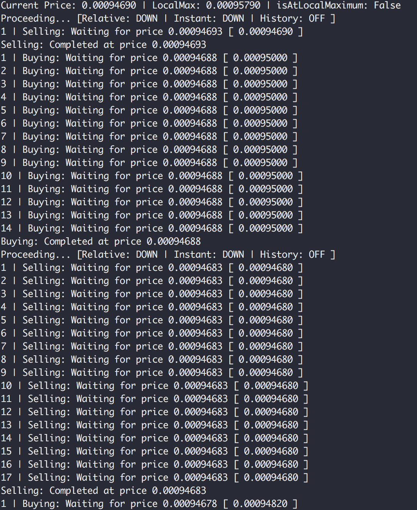

# DigitalTrader

DigitalTrader is an automated high frequency cryptocurrency trading bot that connects to popular exchanges and takes advantage of price trends, dips, volatility, etc.

## Setup
In bot.py:
- Set `API_KEY` and `SECRET` to the corresponding Binance account values
- Set `ACTIVE` to `False` if you only want a simulation of trades and do not want to actually trade with your Binance account; otherwise `True` if do you wish to trade with your account
- Set `TRADE_AMOUNT` to the amount of coins that you wish to trade at a time
- Set `CANCEL_SELL_TIME` to the number of server pings you wish to wait for before cancelling current sell order
- Set `USE_HISTORICAL_DIRECTION` to `False` if you do not want to use a longer history of the price of the currency's trend; otherwise `True`
- Set `DEFAULT_OFFSET` to the default price difference that you want the bot to look for and take advantage of when trading

## Usage
Use the following command in the project directory: `python3 bot.py [currency] [OPTIONAL:offset]` 

## Screenshot
Trading with XRP/BTC:

## Credit
- Binance
- [Simple Binance API Client](https://github.com/toshima/binance/tree/c025c5e96ddf80837f2dcaf9eea8325a2ec62e65) by toshima
